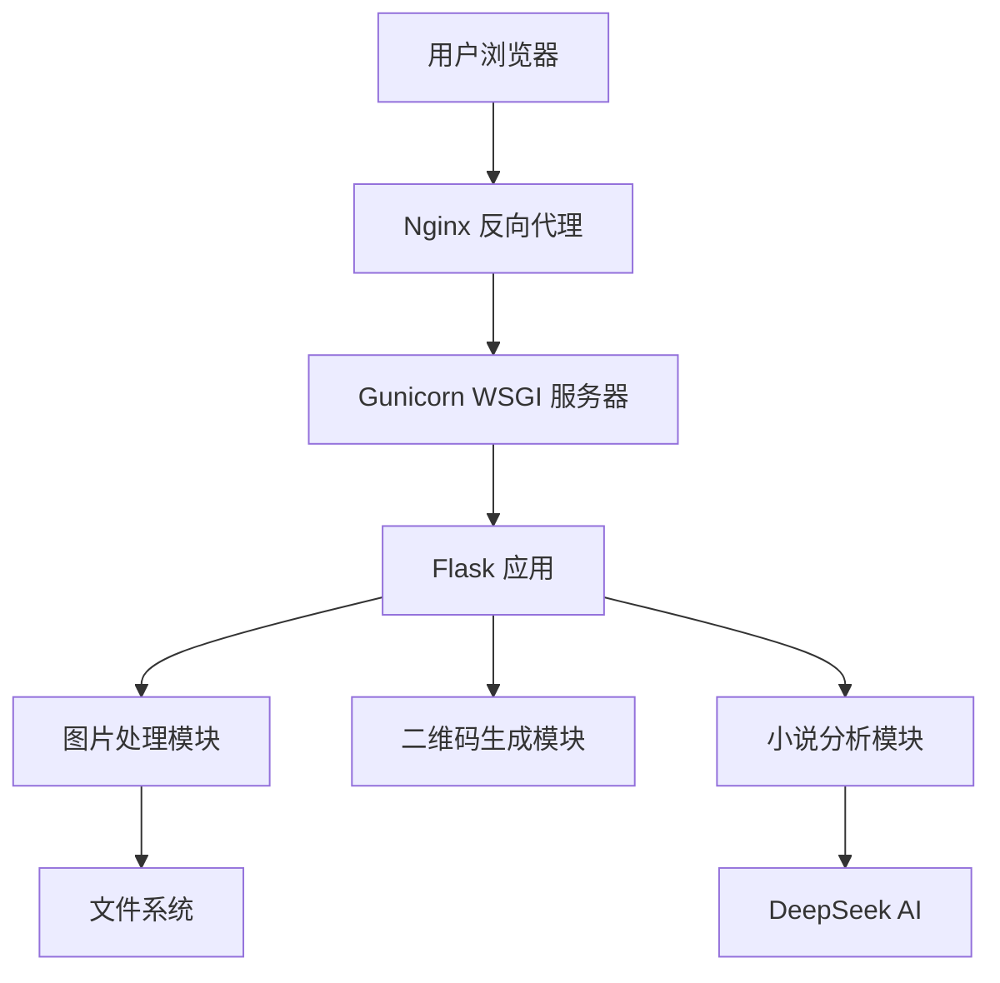

# 图片压缩工具 (Image Compression Tool)

一个简单高效的在线图片压缩工具，支持多种图片格式的压缩。

## 功能特点

- 支持 JPG、PNG、GIF 格式图片
- 支持有损和无损压缩
- 可调节压缩质量
- 实时预览压缩效果
- 显示压缩前后的文件大小对比
- 支持大文件（最大 16MB）
- 智能压缩算法，确保最佳压缩效果

## 技术栈

- 后端：Python + Flask
- 前端：HTML5 + CSS3 + JavaScript
- 图片处理：Pillow
- 服务器：Gunicorn + Gevent

## 项目架构

### 目录结构
```
MaogeToolbox/
├── app.py              # 主应用程序入口
├── requirements.txt    # Python 依赖列表
├── README.md          # 项目文档
│
├── static/            # 静态资源目录
│   ├── css/          # 样式文件
│   ├── js/           # JavaScript 文件
│   └── img/          # 图片资源
│
├── templates/         # HTML 模板目录
│   ├── index.html    # 主页面
│   └── ...           # 其他模板
│
├── uploads/          # 文件上传目录
│
└── 部署配置/
    ├── deploy.sh         # 部署脚本
    ├── nginx.conf        # Nginx 配置
    ├── gunicorn.conf.py  # Gunicorn 配置
    └── gunicorn.service  # Systemd 服务配置

### 核心组件

1. Web 服务
   - Flask 应用服务器
   - Gunicorn WSGI 服务器
   - Nginx 反向代理

2. 功能模块
   - 图片压缩模块
     - Pillow 图像处理
     - 压缩算法优化
   - 二维码生成模块
     - qrcode 生成
     - 自定义样式支持
   - 小说分析模块
     - jieba 分词
     - DeepSeek AI 集成

3. 安全特性
   - HTTPS/SSL 加密
   - 文件上传限制
   - 请求频率限制

### 技术架构



### 部署架构


## 安装

1. 克隆仓库
```bash
git clone https://github.com/sun409377708/MaogeToolbox.git
cd MaogeToolbox
```

2. 安装依赖
```bash
pip install -r requirements.txt
```

3. 运行应用
```bash
python app.py
```

访问 http://localhost:5000 即可使用

## 部署

### 前置条件

- Python 3.6+
- Nginx
- Git
- 域名（可选）

### 自动部署

1. 修改 `deploy.sh` 中的服务器信息
```bash
SERVER="root@your-server-ip"
```

2. 运行部署脚本
```bash
chmod +x deploy.sh
./deploy.sh
```

### 手动部署步骤

1. 在服务器上安装依赖
```bash
sudo yum update -y
sudo yum install -y python3-devel gcc nginx
sudo yum groupinstall -y "Development Tools"
```

2. 配置项目目录
```bash
mkdir -p /var/www/MaogeToolbox
cd /var/www/MaogeToolbox
```

3. 设置虚拟环境
```bash
python3 -m venv venv
source venv/bin/activate
pip install -r requirements.txt
```

4. 配置 Nginx
```bash
sudo cp nginx.conf /etc/nginx/conf.d/maoge.conf
sudo nginx -t
sudo systemctl restart nginx
```

5. 配置 Gunicorn 服务
```bash
sudo cp gunicorn.service /etc/systemd/system/
sudo systemctl daemon-reload
sudo systemctl enable gunicorn
sudo systemctl start gunicorn
```

## 故障排除

### 常见问题

1. 502 Bad Gateway
- 检查 Gunicorn 是否正在运行：`systemctl status gunicorn`
- 检查日志：`tail -f /var/log/gunicorn/error.log`
- 确保端口配置正确：Nginx 配置中的 proxy_pass 端口应与 gunicorn.conf.py 中的端口一致

2. Nginx 配置冲突
- 检查 `/etc/nginx/conf.d/` 目录下是否有多个配置文件监听同一个域名
- 删除不需要的配置文件：`sudo rm /etc/nginx/conf.d/default.conf`

3. SSL 证书问题
- 确保证书路径正确
- 检查证书是否过期：`certbot certificates`
- 更新证书：`certbot renew`

### 查看日志

- Nginx 错误日志：`tail -f /var/log/nginx/error.log`
- Gunicorn 错误日志：`tail -f /var/log/gunicorn/error.log`
- 应用日志：`tail -f /var/log/gunicorn/access.log`

## 维护

### 更新应用

1. 拉取最新代码
2. 运行 `./deploy.sh`

### 备份

定期备份以下内容：
- 数据库（如果有）
- 上传的文件（/uploads 目录）
- 配置文件

## 开发者

- 猫哥工具箱团队

## 许可证

MIT License
